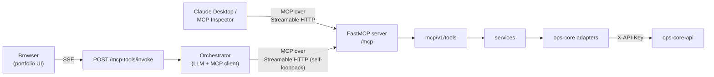

# MCP Ops Agent

A **real [Model Context Protocol](https://modelcontextprotocol.io) server** (built on
FastMCP from the official MCP Python SDK) for a wellness-clinic operations desk, plus a
self-consuming **agentic orchestrator** that reaches those tools the same way any
external client does — over genuine MCP JSON-RPC. The tools are defined **exactly once**
and every consumer goes through the protocol; nothing calls the business logic behind
its back.

The service owns no database. All data comes from a separate internal API
([`ops-core-api`](../ops-core-api)) over HTTP; this repo is a pure MCP + orchestration
layer.

> A companion project. The layered architecture it follows is shared across the
> portfolio and documented in [`../architecture.md`](../architecture.md); the
> MCP-specific additions are in [`docs/architecture.md`](docs/architecture.md).

## What it does

Four MCP tools, each a thin wrapper over a service that calls `ops-core-api` through an
interface:

| Tool | Does |
|------|------|
| `check_calendar_availability(date, time, resource_type)` | Is a slot free? Returns match/availability/capacity and other free times that day. |
| `lookup_customer(name_or_id)` | Finds customers by name fragment or exact UUID. |
| `calculate_quote(service, quantity)` | Prices a service with volume discounts (money stays exact). |
| `send_notification(recipient, message)` | **Simulated** — logs the send and returns a receipt; nothing is actually delivered. |

## Two consumers, one server



1. **External MCP client** (Claude Desktop, MCP Inspector, …) connects straight to
   `/mcp` over Streamable HTTP and drives the tools by hand.
2. **Internal orchestrator** is itself an MCP *client* to the same `/mcp`: an LLM loop
   that lists the tools, calls them over the protocol, and streams each step.
3. **`POST /mcp-tools/invoke`** is a thin HTTP route over the orchestrator. It streams
   the agent's steps to the browser as **Server-Sent Events** — you watch the agent
   decide, call a tool, read the result, and answer — without ever putting the LLM key
   or an MCP client in the browser.

Because the orchestrator connects to the server's *own* mounted `/mcp` over real HTTP,
there is no code path that invokes a tool outside the MCP protocol.

## Architecture

Layered, with a strict inward dependency rule (outer depends on inner, never the
reverse) — the shared portfolio architecture, plus a versioned `mcp/v1/` layer that
mirrors `api/v1/`:

```
mcp/v1/tools  ─┐                 api/v1 (HTTP: SSE route, health)
               ├─► services (business logic) ─► interfaces (ABC) ◄─ repositories / llm
orchestrator ──┘                                     ▲
                          contracts (DTOs) ──────────┘   core · exceptions · bootstrap
```

**Design patterns (named and commented in the code):**

- **Factory** — `llm/factory.py`, `repositories/ops_core/client.py` (the only places the
  SDK / HTTP clients are built).
- **Repository** — `interfaces/ops_core/*` abstract data access.
- **Adapter** — the httpx `repositories/ops_core/*` adapters and
  `repositories/agent/mcp_tool_gateway.py` (an MCP client behind a plain interface).
- **Strategy** — `NotificationChannel` (simulated now, real email/SMS later, no service
  change).
- **Template Method** — the orchestrator's fixed `run()` loop skeleton.
- **Dependency Inversion** throughout — services depend on interfaces; the DI container
  in `bootstrap/container.py` wires concretes.

## Run locally

Prerequisites: Docker, and a running seeded [`ops-core-api`](../ops-core-api); plus an
OpenAI API key (or any OpenAI-compatible, tool-calling endpoint).

```bash
cp .env.example .env
# edit .env: set LLM_API_KEY, and OPS_CORE_API_KEY / OPS_CORE_BASE_URL to match ops-core-api
```

**Docker** — this agent has no database of its own, so compose runs just the service. It
must reach `ops-core-api`; put both on one docker network:

```bash
docker network create ops-net          # once; start ops-core-api attached to it too
docker compose up --build              # agent on http://localhost:8000
```

(With `ops-core-api` on the same network, set `OPS_CORE_BASE_URL=http://api:8000`. If it
runs on the host instead, use `http://host.docker.internal:8000`.)

**Without Docker:**

```bash
uv sync
uv run uvicorn src.main:app --reload    # http://localhost:8000
```

## Try it

**Composite request over SSE** (`-N` disables curl buffering so you see events arrive):

```bash
curl -N -X POST http://localhost:8000/mcp-tools/invoke \
  -H "Content-Type: application/json" \
  -d '{"message": "Is the 18:00 table free tomorrow, and can you look up Anna Petrova?"}'
```

```text
event: tool_call
data: {"id":"call_1","name":"check_calendar_availability","arguments":{"date":"2026-07-26","time":"18:00","resource_type":"table"}}

event: tool_result
data: {"id":"call_1","name":"check_calendar_availability","content":"{\"available\": true, \"capacity\": 4, ...}","is_error":false}

event: tool_call
data: {"id":"call_2","name":"lookup_customer","arguments":{"name_or_id":"Anna Petrova"}}

event: tool_result
data: {"id":"call_2","name":"lookup_customer","content":"{\"count\": 1, ...}","is_error":false}

event: final
data: {"content":"The 18:00 table is free tomorrow (seats 4), and I found Anna Petrova (active)."}
```

**Health:**

```bash
curl http://localhost:8000/health/live      # {"status":"ok"}
```

## Connect an external MCP client to `/mcp`

The server speaks MCP over **Streamable HTTP** at `http://localhost:8000/mcp`.

**MCP Inspector** (quickest way to see tools and call them live):

```bash
npx @modelcontextprotocol/inspector
# In the UI: Transport = "Streamable HTTP", URL = http://localhost:8000/mcp → Connect
```

**Claude Desktop** — bridge stdio to the HTTP endpoint via `mcp-remote` in
`claude_desktop_config.json`:

```json
{
  "mcpServers": {
    "ops-agent": {
      "command": "npx",
      "args": ["mcp-remote", "http://localhost:8000/mcp"]
    }
  }
}
```

Restart Claude Desktop; the four tools appear and execute against the very same server
the internal orchestrator uses.

## Tests

```bash
uv run ruff check .
uv run mypy src
uv run pytest --cov=src/app/services --cov-report=term-missing
```

The suite includes unit tests for every service (mocked interfaces), Pydantic
tool-argument validation, the orchestrator loop (scripted LLM + fake gateway), an
in-memory MCP round-trip, and — the headline — a **hermetic real-loopback test**
(`tests/integration/test_self_loopback.py`) that boots the whole app on a loopback port
and asserts a compound request streams two sequential `tool_call` events then a final
answer, with the orchestrator self-calling the mounted `/mcp` over genuine Streamable
HTTP. No live LLM or `ops-core-api` is required — both are mocked.

## Configuration

All via environment (see [`.env.example`](.env.example)); grouped by prefix:

| Prefix | Concern |
|--------|---------|
| `LOG_` | Log level and format (json/text). |
| `LLM_` | Provider, model, key, base URL — OpenAI-compatible; the demo defaults to OpenAI. |
| `OPS_CORE_` | `ops-core-api` base URL, `X-API-Key`, timeout, retries. |
| `AGENT_` | `MAX_STEPS`, and `MCP_SELF_URL` (the orchestrator's loopback to `/mcp`). |

---

# MCP Ops Agent (RU)

Настоящий **MCP-сервер** ([Model Context Protocol](https://modelcontextprotocol.io),
на FastMCP из официального MCP Python SDK) для операционного пульта wellness-клиники и
**внутренний агент-оркестратор**, который обращается к тем же инструментам так же, как
любой внешний клиент — через настоящий MCP JSON-RPC. Инструменты определены **ровно один
раз**, и каждый потребитель идёт через протокол; ничто не вызывает бизнес-логику в обход.

У сервиса нет собственной базы данных. Все данные приходят из отдельного внутреннего API
([`ops-core-api`](../ops-core-api)) по HTTP; этот репозиторий — чистый слой MCP и
оркестрации.

> Слоистая архитектура общая для портфолио и описана в
> [`../architecture.md`](../architecture.md); MCP-специфика — в
> [`docs/architecture.md`](docs/architecture.md).

## Что делает

Четыре MCP-инструмента, каждый — тонкая обёртка над сервисом, который обращается к
`ops-core-api` через интерфейс:

| Инструмент | Что делает |
|------------|------------|
| `check_calendar_availability(date, time, resource_type)` | Свободен ли слот? Возвращает совпадение/доступность/вместимость и другие свободные времена в этот день. |
| `lookup_customer(name_or_id)` | Ищет клиентов по фрагменту имени или точному UUID. |
| `calculate_quote(service, quantity)` | Считает стоимость услуги с объёмными скидками (деньги — точно, без float). |
| `send_notification(recipient, message)` | **Симуляция** — логирует отправку и возвращает квитанцию; на самом деле ничего не отправляется. |

## Два потребителя, один сервер

1. **Внешний MCP-клиент** (Claude Desktop, MCP Inspector) подключается прямо к `/mcp`
   по Streamable HTTP и вызывает инструменты вручную.
2. **Внутренний оркестратор** сам является MCP-*клиентом* к тому же `/mcp`: LLM-цикл,
   который получает список инструментов, вызывает их через протокол и стримит каждый шаг.
3. **`POST /mcp-tools/invoke`** — тонкий HTTP-роутер поверх оркестратора. Стримит шаги
   агента в браузер как **Server-Sent Events**: видно, как агент решает, вызывает
   инструмент, читает результат и отвечает — без переноса LLM-ключа или MCP-клиента в
   браузер.

Поскольку оркестратор подключается к *собственному* смонтированному `/mcp` по настоящему
HTTP, не существует пути, которым инструмент вызывался бы в обход MCP-протокола.

## Архитектура

Слоистая, со строгим правилом однонаправленных зависимостей (внешние слои зависят от
внутренних, никогда наоборот) — общая архитектура портфолио плюс версионированный слой
`mcp/v1/`, зеркалящий `api/v1/`.

**Паттерны (названы и прокомментированы в коде):** Factory (`llm/factory.py`,
`repositories/ops_core/client.py`), Repository (`interfaces/ops_core/*`), Adapter
(httpx-адаптеры и `mcp_tool_gateway.py`), Strategy (`NotificationChannel`), Template
Method (цикл `run()` оркестратора), Dependency Inversion — везде.

## Запуск локально

Нужны: Docker и запущенный засиженный [`ops-core-api`](../ops-core-api); ключ OpenAI (или
любой OpenAI-совместимый endpoint с поддержкой tool-calling).

```bash
cp .env.example .env
# в .env задайте LLM_API_KEY, а также OPS_CORE_API_KEY / OPS_CORE_BASE_URL под ops-core-api
docker network create ops-net     # один раз; ops-core-api подключите к этой же сети
docker compose up --build         # агент на http://localhost:8000
```

Без Docker:

```bash
uv sync
uv run uvicorn src.main:app --reload
```

## Примеры

Составной запрос через SSE:

```bash
curl -N -X POST http://localhost:8000/mcp-tools/invoke \
  -H "Content-Type: application/json" \
  -d '{"message": "Свободен ли завтра столик на 18:00 и найди Анну Петрову?"}'
```

Ответ — поток событий `tool_call` → `tool_result` (по одному на каждый инструмент) и
финальное `final` со связным ответом (см. английский пример выше).

## Подключение внешнего MCP-клиента к `/mcp`

Сервер говорит по MCP через **Streamable HTTP** на `http://localhost:8000/mcp`. Быстрее
всего — MCP Inspector (`npx @modelcontextprotocol/inspector`, транспорт «Streamable
HTTP», URL `http://localhost:8000/mcp`). Для Claude Desktop используйте мост `mcp-remote`
в `claude_desktop_config.json` (см. английскую версию).

## Тесты

```bash
uv run ruff check .
uv run mypy src
uv run pytest --cov=src/app/services --cov-report=term-missing
```

Ключевой тест — герметичный self-loopback (`tests/integration/test_self_loopback.py`):
поднимает всё приложение на loopback-порту и проверяет, что составной запрос стримит два
последовательных события `tool_call` и финальный ответ, причём оркестратор реально
дергает смонтированный `/mcp` по Streamable HTTP. Живые LLM и `ops-core-api` не нужны —
оба замоканы.
