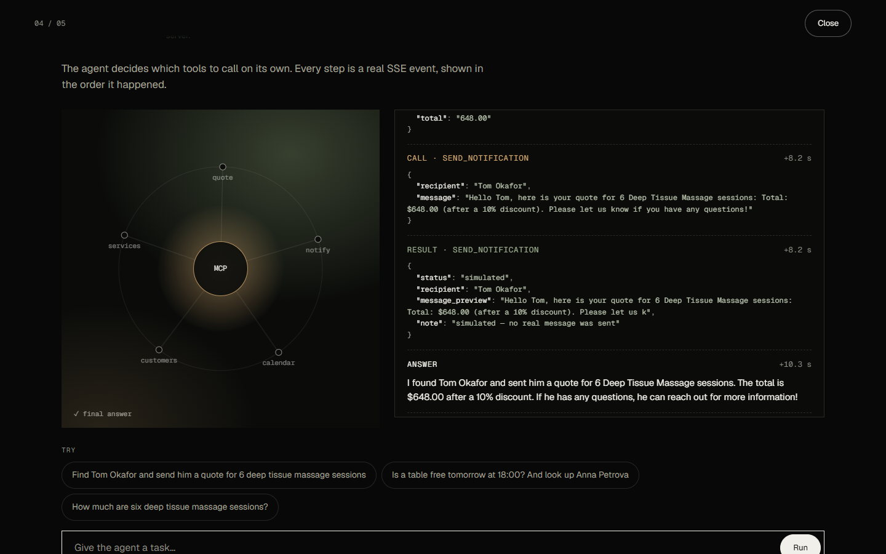
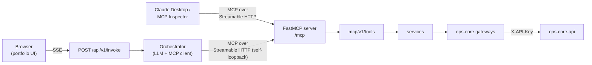

# MCP Ops Agent

[](https://github.com/upkero/mcp-ops-agent/actions/workflows/ci.yml)
[](LICENSE)
[](https://www.python.org/downloads/)

*[Русская версия](README.ru.md)*

A **real [Model Context Protocol](https://modelcontextprotocol.io) server** (built on
FastMCP from the official MCP Python SDK) for an operations desk, plus a
self-consuming **agentic orchestrator** that reaches those tools the same way any
external client does — over genuine MCP JSON-RPC. The tools are defined **exactly once**
and every consumer goes through the protocol; nothing calls the business logic behind
its back.



*The live demo: every tool call and result arrives as its own SSE event.*

The service owns no database. All data comes from a separate internal API
([`ops-core-api`](https://github.com/upkero/ops-core-api)) over HTTP; this repo is a pure
MCP + orchestration layer.

> A companion project. The MCP-specific architecture notes are in
> [`docs/architecture.md`](docs/architecture.md).

## What it does

Five MCP tools, each a thin wrapper over a service that calls `ops-core-api` through an
interface:

| Tool | Does |
|------|------|
| `check_calendar_availability(date, time, resource_type)` | Is a slot free? Returns match/availability/capacity and other free times that day. |
| `list_services()` | Lists every service on the price list with its unit price. |
| `lookup_customer(name_or_id)` | Finds customers by name fragment or exact UUID. |
| `calculate_quote(service, quantity)` | Prices a service with volume discounts (money stays exact). |
| `send_notification(recipient, message)` | **Simulated** — logs the send and returns a receipt; nothing is actually delivered. The recipient must be one existing customer (id or full name, checked against `ops-core-api`), the message is at most 1000 characters, and a run may send at most `AGENT_MAX_NOTIFICATIONS_PER_RUN` (3). |

## Two consumers, one server



1. **External MCP client** (Claude Desktop, MCP Inspector, …) connects straight to
   `/mcp` over Streamable HTTP and drives the tools by hand.
2. **Internal orchestrator** is itself an MCP *client* to the same `/mcp`: an LLM loop
   that lists the tools, calls them over the protocol, and streams each step.
3. **`POST /api/v1/invoke`** is a thin HTTP route over the orchestrator. It streams
   the agent's steps to the browser as **Server-Sent Events** — you watch the agent
   decide, call a tool, read the result, and answer — without ever putting the LLM key
   or an MCP client in the browser.

Because the orchestrator connects to the server's *own* mounted `/mcp` over real HTTP,
there is no code path that invokes a tool outside the MCP protocol.

## Architecture

Layered, with a strict inward dependency rule (outer depends on inner, never the
reverse) — the shared portfolio architecture, plus a versioned `mcp/v1/` layer that
mirrors `api/v1/`:

```
mcp/v1/tools  ─┐                 api/v1 (HTTP: SSE route, health)
               ├─► services (business logic) ─► interfaces (ABC) ◄─ gateways / llm
orchestrator ──┘                                     ▲
                          contracts (DTOs) ──────────┘   core · exceptions · bootstrap
```

`gateways/` rather than `repositories/`: this service owns no store, so every adapter is
somebody else's service over the network.

**Design patterns (named and commented in the code):**

- **Factory** — `llm/factory.py`, `gateways/ops_core/client.py` (the only places the
  SDK / HTTP clients are built).
- **Adapter** — the httpx `gateways/ops_core/*` adapters and
  `gateways/agent/mcp_tool_gateway.py` (an MCP client behind a plain interface).
- **Strategy** — `NotificationChannel` (simulated now; a real email/SMS channel is a new
  implementation, but read the notification limits under
  [Exposing this service](#exposing-this-service) first).
- **Template Method** — the orchestrator's fixed `run()` loop skeleton.
- **Dependency Inversion** throughout — services depend on interfaces; the DI container
  in `bootstrap/container.py` wires concretes.

## Run locally

Prerequisites: Docker, and a running
[`ops-core-api`](https://github.com/upkero/ops-core-api) with its demo data loaded; plus
an OpenAI API key (or any OpenAI-compatible, tool-calling endpoint).

```bash
cp .env.example .env
# edit .env: set LLM_API_KEY, and OPS_CORE_API_KEY / OPS_CORE_BASE_URL to match ops-core-api
```

**Docker** — this agent has no database of its own, so compose runs just the service, and
reaches `ops-core-api` through `host.docker.internal`. There is no shared docker network,
so both compose files stay independent:

```bash
docker compose up --build     # agent on http://127.0.0.1:8003
```

The port is published on **loopback only** (`127.0.0.1:8003:8000`) on purpose — see
[Exposing this service](#exposing-this-service). Inside the container it still listens on
8000, which is why `AGENT_MCP_SELF_URL` stays `http://localhost:8000/mcp/`. With
`ops-core-api` running on the host, set
`OPS_CORE_BASE_URL=http://host.docker.internal:8000`.

**Without Docker** — pick 8003 so `ops-core-api` keeps 8000, and move the self-loopback to
the same port or the orchestrator will call nothing:

```bash
uv sync
AGENT_MCP_SELF_URL=http://localhost:8003/mcp/ \
  uv run uvicorn src.main:app --reload --port 8003
```

## Try it

**Composite request over SSE** (`-N` disables curl buffering so you see events arrive):

```bash
curl -N -X POST http://localhost:8003/api/v1/invoke \
  -H "Content-Type: application/json" \
  -d '{"message": "Is the 18:00 table free tomorrow, and can you look up Anna Petrova?"}'
```

```text
event: tool_call
data: {"id":"call_1","name":"check_calendar_availability","arguments":{"date":"2026-07-26","time":"18:00","resource_type":"table"}}

event: tool_result
data: {"id":"call_1","name":"check_calendar_availability","content":"{\"available\": true, \"capacity\": 4, ...}","is_error":false}

event: tool_call
data: {"id":"call_2","name":"lookup_customer","arguments":{"name_or_id":"Anna Petrova"}}

event: tool_result
data: {"id":"call_2","name":"lookup_customer","content":"{\"count\": 1, ...}","is_error":false}

event: final
data: {"content":"The 18:00 table is free tomorrow (seats 4), and I found Anna Petrova (active)."}
```

**Health** — liveness is the process alone; readiness reports both upstreams:

```bash
curl http://localhost:8003/health/live     # {"status":"ok"}
curl http://localhost:8003/health/ready    # {"status":"ok"}; 503 {"detail":"dependencies unavailable: llm",...} if a dependency is down
```

Docker's `HEALTHCHECK` polls `/health/live`, so the container is not marked unhealthy
because the LLM provider is having a bad morning.

**Auth** — `POST /api/v1/invoke` requires `SECURITY_API_KEY` (≥16 chars) as `X-API-Key`.
The service does not start without it; `.env.example` ships the portfolio's shared
placeholder `change-me-min-16-chars`:

```bash
curl -N -X POST http://localhost:8003/api/v1/invoke \
  -H "X-API-Key: $SECURITY_API_KEY" -H "Content-Type: application/json" \
  -d '{"message":"..."}'
```

## Connect an external MCP client to `/mcp`

Run the service locally and point your MCP client at **your own localhost** — that is the
intended shape, not a hosted URL.

**MCP Inspector** (quickest way to see tools and call them live):

```bash
npx @modelcontextprotocol/inspector
# In the UI: Transport = "Streamable HTTP", URL = http://localhost:8003/mcp → Connect
```

**Claude Desktop** — bridge stdio to your local endpoint via `mcp-remote` in
`claude_desktop_config.json`:

```json
{
  "mcpServers": {
    "ops-agent": {
      "command": "npx",
      "args": ["mcp-remote", "http://localhost:8003/mcp"]
    }
  }
}
```

Restart Claude Desktop; the five tools appear and execute against the very same server
the internal orchestrator uses.

## Exposing this service

`/mcp` is unauthenticated: MCP clients rely on the protocol's own auth story, and the
self-loopback needs no key. That is fine on localhost and **not** fine on the open
internet, so this is a deployment decision rather than a code one:

- **`/mcp` is closed at the perimeter.** Only `POST /api/v1/invoke`, with its own
  `SECURITY_API_KEY`, faces outward.
- **Replace the placeholder `SECURITY_API_KEY` before exposing anything publicly.** The per-IP rate limit
  (`INVOKE_RATE_LIMIT_PER_MINUTE`, 20 by default) protects against abuse, not against
  cost: 20 requests a minute from one address × up to `AGENT_MAX_STEPS` LLM calls each is
  real money.
- Compose publishes on `127.0.0.1:8003` rather than `0.0.0.0:8003` so none of the above
  can happen by accident on a machine with a public IP.
- **Whoever holds `SECURITY_API_KEY` reaches everything the tools return** through
  `POST /api/v1/invoke`: customer records including their notes. The public demo runs on
  synthetic data; with real data, treat the key accordingly.
- **`/mcp` is protected only by the SDK's DNS-rebinding check**: a `Host` that is not
  `localhost`/`127.0.0.1` gets `421`, a foreign `Origin` gets `403`. Behind a reverse proxy
  that forwards a public `Host`, `/mcp` therefore answers `421`; keep it internal.
- **What bounds one run:** `AGENT_MAX_STEPS`, `AGENT_RUN_TIMEOUT_SECONDS` (60), at most
  `AGENT_MAX_TOOL_CALLS_PER_STEP` (4) tool calls per LLM turn, `AGENT_MAX_NOTIFICATIONS_PER_RUN`
  (3) and `LLM_MAX_TOKENS` (1024) per turn. The tokens a run used are logged as `agent.usage`.
- **One rate-limit bucket per source address.** Behind a proxy or a site bridge every visitor
  arrives from the same address and shares the 20 a minute; limit per visitor there.

## Tests

```bash
uv run ruff check .
uv run mypy src
uv run pytest --cov=src/app/services --cov-report=term-missing --cov-fail-under=60
```

The suite includes unit tests for every service (mocked interfaces), Pydantic
tool-argument validation, the orchestrator loop (scripted LLM + fake gateway), an
in-memory MCP round-trip, and — the headline — a **hermetic real-loopback test**
(`tests/integration/test_self_loopback.py`) that boots the whole app on a loopback port
and asserts a compound request streams two sequential `tool_call` events then a final
answer, with the orchestrator self-calling the mounted `/mcp` over genuine Streamable
HTTP. No live LLM or `ops-core-api` is required — both are mocked.

## Configuration

All via environment (see [`.env.example`](.env.example)); grouped by prefix:

| Prefix | Concern |
|--------|---------|
| `LOG_` | Log level and format (json/text). |
| `LLM_` | Provider, model, key, base URL — OpenAI-compatible. |
| `OPS_CORE_` | `ops-core-api` base URL, `X-API-Key`, timeout, total attempts. |
| `AGENT_` | `MAX_STEPS`, `RUN_TIMEOUT_SECONDS`, `MAX_TOOL_CALLS_PER_STEP`, `MAX_NOTIFICATIONS_PER_RUN`, and `MCP_SELF_URL` (the orchestrator's loopback to `/mcp/`). |
| `SECURITY_` | `API_KEY`, required, gating `POST /api/v1/invoke`. |
| `CORS_` | `ALLOWED_ORIGINS`, comma-separated. |

Three things worth knowing before the first run:

- **The default provider is OpenAI, deliberately** — unlike the sibling services, which
  default to a local Ollama model. An agentic tool-calling loop is unreliable on a small
  local model, and reliable tool calling is precisely what this service exists to
  demonstrate. Point `LLM_BASE_URL` at Ollama if you would rather trade that for free.
- **`CORS_ALLOWED_ORIGINS` is empty by default**, which blocks every browser client. A
  frontend needs its origin listed there before it can call in.
- **The `OPS_CORE_API_KEY` placeholder `change-me-min-16-chars` is shared by all five
  services in the portfolio** and is rotated in all five at once, so it matches every
  sibling's `.env.example`. You still set `LLM_API_KEY` yourself.
